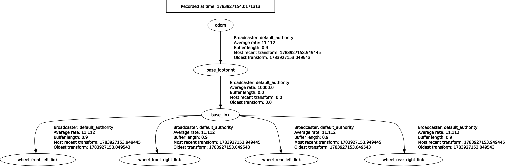

# ITRI 底盤 ROS2 驅動層（chassis-ros2-driver）

適用機型：ITRI 四輪底盤
文件日期：2026 年 7 月

## 專案簡介

`chassis_driver` 是底盤與上位應用之間的轉譯層，將底盤控制板（VCU）的 RS485 二進位通訊協定封裝為標準 ROS2 介面。上位開發者不需要處理序列通訊、封包編解碼、運動學換算，只需訂閱／發布標準 topic，即可直接串接 Nav2、SLAM、`robot_localization` 等現成 ROS2 生態系套件。

RS485 序列埠為單一裝置獨佔資源，因此所有與 VCU 的通訊邏輯集中於單一節點 `chassis_driver`，內部再拆分發布為多個語意明確的 topic。

## 目錄

1. [套件一覽](#1-套件一覽)
2. [節點分工](#2-節點分工)
3. [硬體平台需求](#3-硬體平台需求)
4. [快速上手指南](#4-快速上手指南)
5. [ROS2 對外介面](#5-ros2-對外介面)
6. [參數說明（vehicle_param.yaml）](#6-參數說明vehicle_paramyaml)
7. [VCU 序列通訊協定摘要](#7-vcu-序列通訊協定摘要)

---

## 1. 套件一覽

| 套件 | 內容 |
|---|---|
| `chassis_msgs` | 底盤自訂訊息定義（`MotorState`） |
| `chassis_driver` | 核心驅動節點，序列通訊、運動學、ROS2 介面 |
| `chassis_description` | URDF/xacro、mesh，底盤幾何與外觀描述 |
| `chassis_bringup` | Launch 檔與參數設定，一鍵啟動底盤 |

## 2. 節點分工

| 節點 | 所屬套件 | 職責 |
|---|---|---|
| `chassis_driver` | `chassis_driver` | 唯一持有序列埠，負責封包收送、運動學換算、對外發布標準 ROS2 介面 |
| `robot_state_publisher` | `robot_state_publisher`（官方套件） | 讀取 URDF，廣播固定關節 tf（如 `base_footprint → base_link`） |

## 3. 硬體平台需求

| 項目 | 版本 / 規格 |
|---|---|
| 作業系統 | Ubuntu 22.04 |
| ROS2 distro | Humble |
| Python 套件 | `pyserial` |
| VCU 連線方式 | USB-to-RS485 轉換器 |

> 本節假設  Ubuntu 環境 與 ROS2 Humble已建置完成。Ubuntu／ROS2 安裝方式請參考官方文件。

## 4. 快速上手指南

### 4.1 udev 固定裝置命名

USB-to-RS485 轉換器的裝置路徑（`/dev/ttyUSBx`）會因插拔順序而改變，建議透過 udev rule 綁定固定名稱。

新增規則檔案：

```bash
sudo nano /etc/udev/rules.d/99-chassis-vcu.rules
```

內容（`idVendor`／`idProduct`／`serial` 請依實際轉換器調整）：

```
SUBSYSTEM=="tty", ATTRS{idVendor}=="0403", ATTRS{idProduct}=="6001", ATTRS{serial}=="<裝置序號>", SYMLINK+="ttyUSB_chassis"
```

套用規則：

```bash
sudo udevadm control --reload-rules
sudo udevadm trigger
```

### 4.2 序列埠權限

將使用者加入 `dialout` 群組（需登出重新登入才生效）：

```bash
sudo usermod -aG dialout $USER
```

### 4.3 編譯

```bash
cd chassis_ws
colcon build --symlink-install
source install/setup.bash
```

### 4.4 啟動底盤

```bash
ros2 launch chassis_bringup bringup.launch.py
```

可選參數：

| 參數 | 說明 | 預設值 |
|---|---|---|
| `xacro_file` | 指定 `chassis_description/urdf/` 底下的 xacro 檔名 | `chassis.urdf.xacro` |
| `vehicle_param_file` | 指定 `chassis_bringup/config/` 底下的參數檔名 | `vehicle_param.yaml` |

### 4.5 基本操作驗證

鍵盤遙控測試（需另行安裝 `teleop_twist_keyboard`）：

```bash
ros2 run teleop_twist_keyboard teleop_twist_keyboard
```

查看底盤狀態：

```bash
ros2 topic echo /battery_state
ros2 topic echo /diagnostics
```

清除馬達 Alarm：

```bash
ros2 service call /clear_alarm std_srvs/srv/Trigger
```

## 5. ROS2 對外介面

### 5.1 訂閱（上位 → 底盤）

| Topic | 型別 | 說明 |
|---|---|---|
| `/cmd_vel` | `geometry_msgs/Twist` | 唯一控制入口，`linear.x` 為線速度（m/s），`angular.z` 為角速度（rad/s）。逾時（預設 0.5 秒）未收到新指令將自動送出零速。 |

### 5.2 發布（底盤 → 上位）

| Topic | 型別 | 說明 |
|---|---|---|
| `/odom` | `nav_msgs/Odometry` | 由實際馬達轉速積分計算，含線速度、角速度與累積位姿。 |
| `/tf`（`odom → base_footprint`） | — | 是否發布由 `publish_tf` 參數控制，預設開啟。 |
| `/joint_states` | `sensor_msgs/JointState` | 四輪關節角度與角速度，供 `robot_state_publisher` 與 RViz 使用。 |
| `/battery_state` | `sensor_msgs/BatteryState` | 電壓、電流、SoC。 |
| `/diagnostics` | `diagnostic_msgs/DiagnosticArray` | VCU 連線狀態、馬達 Alarm、封包遺漏偵測。 |
| `/chassis/motor_state` | `chassis_msgs/MotorState` | 原始馬達轉速、霍爾值、Alarm 狀態，未套用方向修正，供進階除錯使用。 |

### 5.3 服務

| Service | 型別 | 說明 |
|---|---|---|
| `/clear_alarm` | `std_srvs/Trigger` | 清除 VCU 馬達 Alarm 狀態（單次觸發）。 |

### 5.4 座標系（TF）

tf 樹結構：



`base_footprint` 為投影於地面（z=0）的參考點，供 Nav2 costmap 與定位套件使用；`base_footprint` 與 `base_link` 之間為固定關節，由 `robot_state_publisher` 依 URDF 自動廣播，不需額外程式碼處理。

若需以 IMU 做感測融合（建議搭配 `robot_localization` 套件），請將 `publish_tf` 設為 `false`，改由 `robot_localization` 的 EKF 節點發布 `odom → base_footprint`，避免兩個節點同時廣播同一條 tf 造成衝突。

## 6. 參數說明（vehicle_param.yaml）

所有底盤參數集中於 `chassis_bringup/config/vehicle_param.yaml`，換裝不同機型時僅需替換此設定檔，不需修改程式碼。

| 參數 | 型別 | 預設值 | 說明 |
|---|---|---|---|
| `port` | string | `/dev/ttyUSB_chassis` | VCU 序列裝置路徑 |
| `baudrate` | int | `19200` | 序列通訊速率 |
| `serial_timeout` | float | `0.5` | 序列讀取逾時（秒） |
| `send_interval` | float | `0.1` | TX 送出間隔（秒），對應 10 Hz |
| `gear_ratio` | float | `50.0` | 減速比（輪端轉速 = 馬達端轉速 ÷ `gear_ratio`） |
| `wheel_radius` | float | `0.2032` | 輪半徑（公尺），16 吋輪徑換算 |
| `wheel_separation` | float | `0.6221` | 左右輪中心距（公尺） |
| `cmd_left_direction` | int（1 或 -1） | `1` | 送出指令時，左馬達方向修正 |
| `cmd_right_direction` | int（1 或 -1） | `1` | 送出指令時，右馬達方向修正 |
| `fb_left_direction` | int（1 或 -1） | `1` | 讀取回報時，左馬達方向修正 |
| `fb_right_direction` | int（1 或 -1） | `1` | 讀取回報時，右馬達方向修正 |
| `publish_tf` | bool | `true` | 是否廣播 `odom → base_footprint` tf |
| `cmd_vel_timeout` | float | `0.5` | `/cmd_vel` 逾時秒數，逾時強制送出零速 |

> `cmd_left_direction`／`cmd_right_direction` 與 `fb_left_direction`／`fb_right_direction` 為獨立參數：前者修正「送出指令」方向，後者修正「讀取回報轉速」方向。兩者物理上可能不同，實際數值需以實測為準，不可假設對稱。

## 7. VCU 序列通訊協定摘要

此章節提供給需要直接檢視或除錯序列通訊的開發者參考，一般上位應用開發不需要接觸此層。

### 7.1 序列設定

| 參數 | 設定值 |
|---|---|
| 裝置路徑 | `/dev/ttyUSB_chassis`（udev 固定命名，見[第 4.1 節](#41-udev-固定裝置命名)） |
| Baudrate | 19200 bps |
| 格式 | 8N1（8 資料位元、無同位元檢查、1 停止位元） |
| 編碼 | 大端序（Big-Endian） |
| 傳送頻率 | 10 Hz（100 ms） |

### 7.2 封包長度

| 方向 | 長度 |
|---|---|
| 主機 → VCU（TX） | 固定 11 bytes |
| VCU → 主機（RX） | 固定 21 bytes |

詳細欄位定義請參考附贈的底盤技術文件。